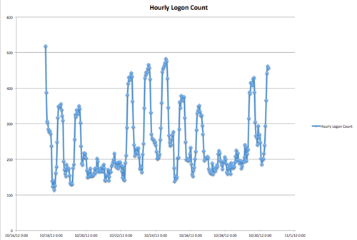

This is a sample blog post, so people know how to write blog posts. Use h2 (via two hash marks) to separate introduction from rest of the blog post. Additionally, you can use horizontal line "-------------".

## More

Everything here won't be on the blog index and people will have to click to expand it.

How to put in an image:

