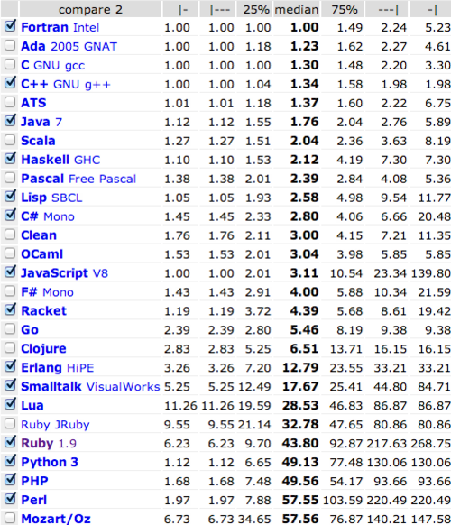
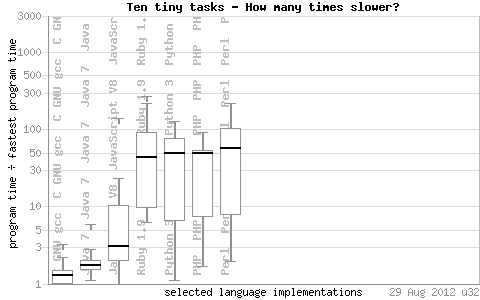

Ruby has a fairly well deserved reputation as a slow language. I tend to think that for its most relevant use cases (running high level programs like [text editors](http://redcareditor.com/) and [web sites](http://basecamp.com/), [etc](http://www.ruby-lang.org/en/documentation/success-stories/)) it doesn't much matter. You could always write your application in C or Java, but who wants to do that if they can help it?

In his article, [Ruby is faster than Python, PHP, and Perl](http://www.unlimitednovelty.com/2012/06/ruby-is-faster-than-python-php-and-perl.html), [Tony Arcieri](http://www.blogger.com/profile/05698660503129206682) claims that Ruby is faster than these other languages. He uses this table to illustrate his point:

Is Ruby really faster though? Not really. It's really effectively the same as these other languages. Check out this graph for some perspective:

see source: http://shootout.alioth.debian.org/u32/which-programming-languages-are-fastest.php

I don't consider this an indictment of Ruby. Actually, I see it as a great reason to use it. If I can get the same performance out of Ruby as Python, PHP, or Perl then I am certainly not going to choose Perl. As for Python or PHP, I think the choice is a matter of taste. I personally like the elegant readability of Ruby. It is written more for my brain than for a CPU. And it's not any slower than the more C-like Python and it's proven itself much more malleable than PHP. Good stuff.

And as for Rails? I don't think its performance is anything to worry about either:

see source: http://blog.curiasolutions.com/the-great-web-framework-shootout/
