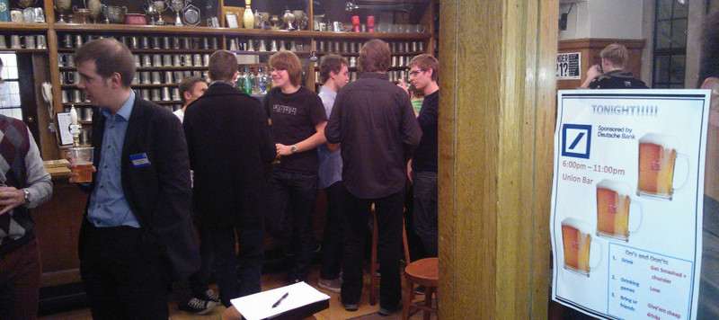
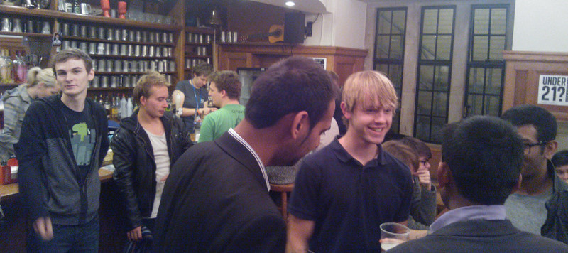

On 1st of November just after Halloween DoCSoc with Deutsche Bank organized a Bar night for computing students. Yay!

The event took place in Union bar where socializing was boosted by subsidized drinks. (thanks to DB) For 3 pounds students could have got any 3 drinks!

Former graduates from Imperial shared their experience of working in the Deutsche Bank as technology engineers, shared some tips on how to get through the hiring process, and talked about projects they are involved in.

Be aware that deadlines for Deutsche Bank:

- Summer internship 17 February
- Spring internship: 18 January
