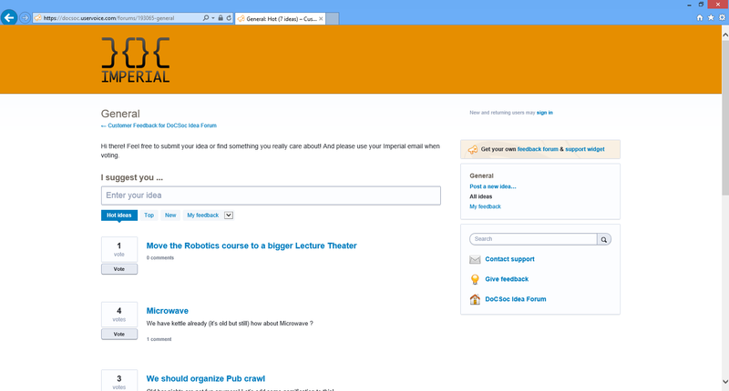

Feedback is really important. Many people in labs express ideas, some of them are great and brilliant some of them are crazy and not feasible. But it’s very hard to distinguish one group from another.

Nevertheless we believe that you have ideas that will make Imperial DoC best computing department in the world. So we are launching DoCSoc Ideas Forum!

Workflow is simple:

1. You think what would be cool to do
1. You go to [http://ideas.docsoc.co.uk](http://ideas.docsoc.co.uk) and submit your idea
1. You tell about your idea to your friends and if they like it they vote for it
1. DoCSoc is trying really hard to make your idea alive!
1.  …
1. PROFIT!

Note, please use your Imperial emails when voting and submitting ideas, it will give as opportunity to filter un-fair votes.
