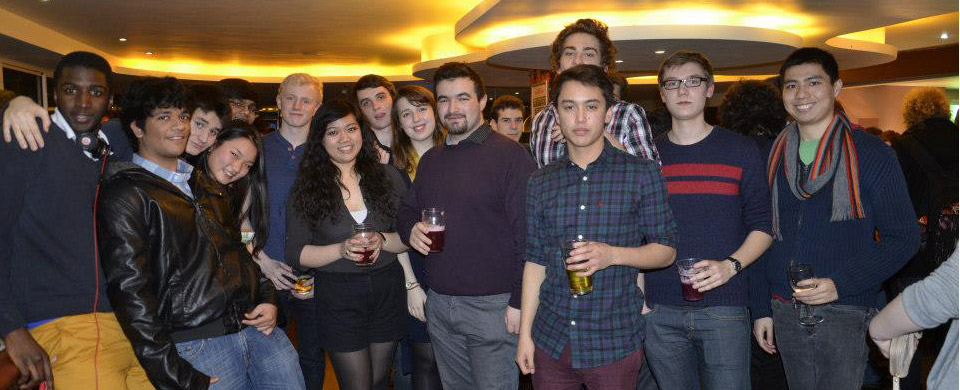

A lot of people like our bar nights; socializing is the main theme of those nights but free drinks seems to be one the main motivator. So to mix things up and help you socialize with wider range of people, (and it was the most popular choice in the Fresher’s group page) I wanted a joint bar night with King’s Computing Society.

So I relayed this idea to the Events Officer of King’s Computing Society and they also liked the idea. They were more than happy to offer their Student Union as the venue and provide half of the drinks and food to make the night a lot more enjoyable.

Throughout the night we mingled and held drinking games. The food and drinks kept on coming until the end of the night for everybody and apparently some people even talked about our computing skills (phhew I’m glad I dodged that bullet!) Overall everybody had fun having had to meet new people. (How did that happen? Your good Events Officer yours truly was present)

See the photos [here](https://www.facebook.com/media/set/?set=a.401505096611740.90989.240284006067184)
