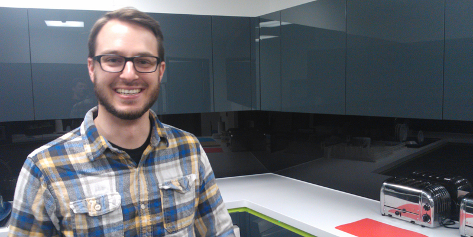
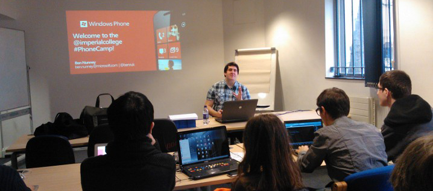
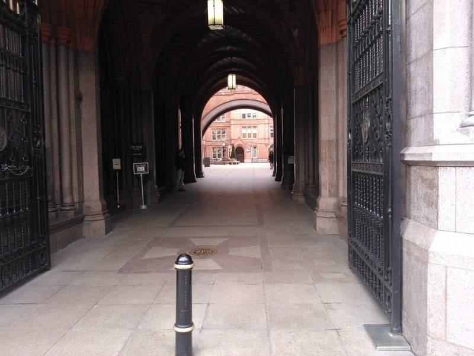
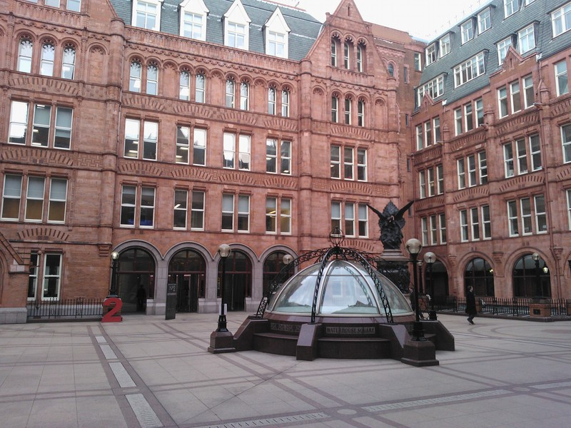
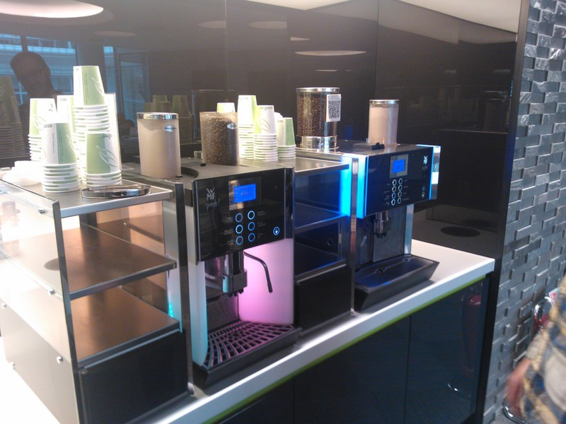
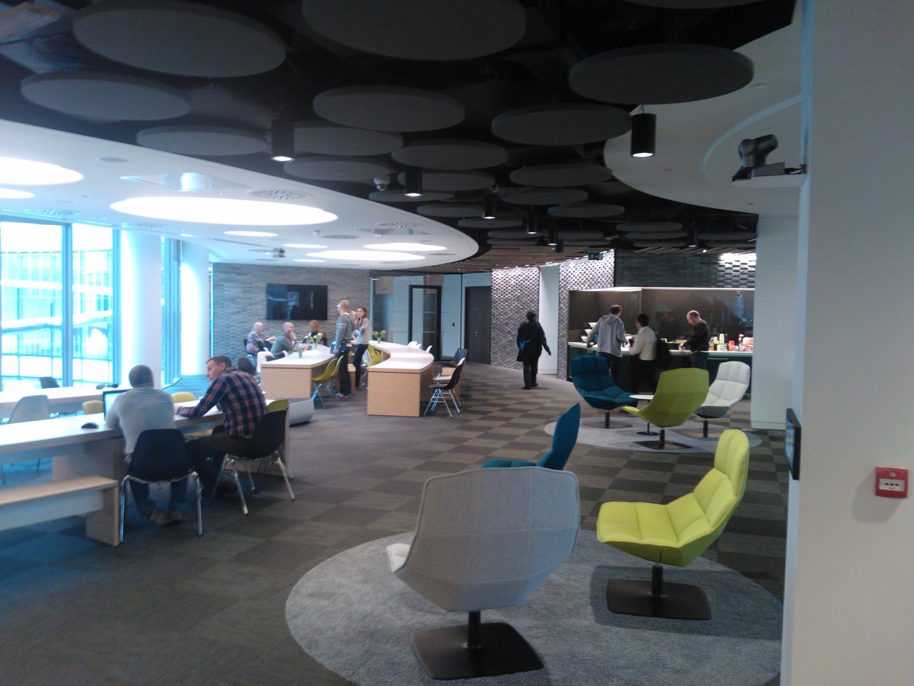

Today I made a brief visit to Skype office to meet Philipp, Microsoft Staffing Consultant, to discuss future collaboration between Microsoft and DoCSoc.

&nbsp;

DoCSoc and Microsoft have some history together:

- Windows Phone camp on 3/7/2012
- Skype lecture and Microsoft recruitments days are organized for 2nd time
- Microsoft also supported us during ICHack (http://ichack.org)

New Skype office is located in the Chancery Lane area; door-to-door journey from Imperial campus takes about 25 min.

<table><tr><td></td><td></td></tr></table>

Office itself is very bright and friendly. Free coffee and breakfast for employees and their guests. Beer on Thursday.

<table><tr><td></td><td></td></tr></table>

You can see several photos from inside the office in this [article](http://www.gizmodo.co.uk/2013/03/i-would-like-to-actually-live-in-skypes-new-london-office/)

This summer term we will try to organize a few lectures about Microsoft latest technologies: Windows 8 development, C#, Building scalable applications in the cloud using Azure and many more cool stuff is coming up.
Stay tuned.
