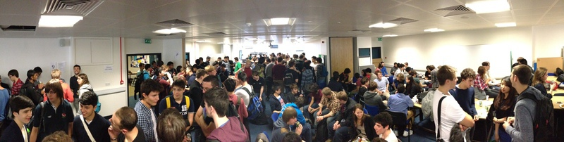
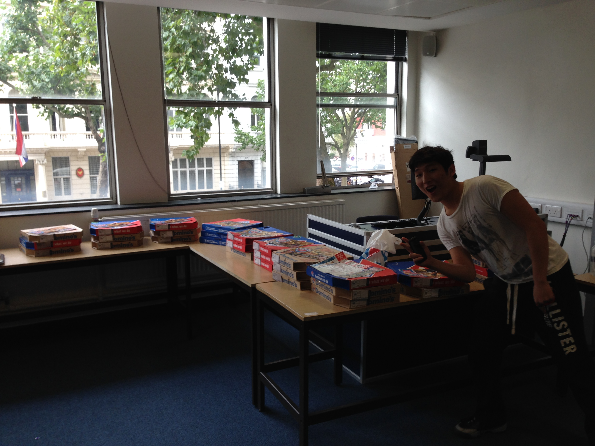
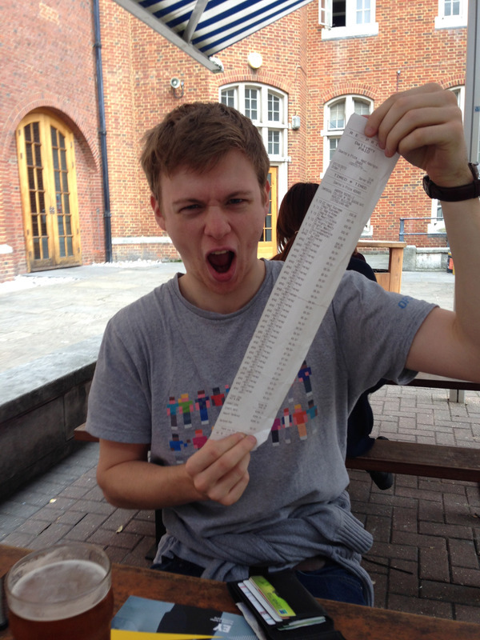

This year's buddies (or 'Mums and Dads') lunch was a great success with over 180 students attending.

The annual buddies lunch is designed to connect new students with students in higher years, as a point of contact during the first few weeks and the first year.

&nbsp;

The event is funded each year by the department (who provided a sandwich lunch and drinks) and DocSoc, who provided lots of pizza from Dominos.

<table><tr><td></td><td></td></tr></table>

To read more about the college's mums and dads scheme see Nat Kempston's article [here](https://www.imperialcollegeunion.org/blogs/deputy-president-education/mums-and-dads-building-family-tree).