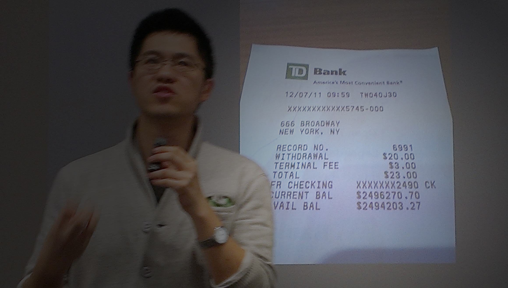

With the sweet promise of free pizza and an interesting talk, students from DoCSoc, King’s College and even a few 6th-formers packed themselves into the Clore Lecture Theatre on a mid-October evening. 

Leng Lee, COO of Codecademy, had kindly agreed to talk to our guests about the rare experience  of taking a three-person startup to millions of users in the short space of two years. In case you didn’t know, Codecademy is the YC S11 startup aiming to teach the world to code for free with its interactive online lessons and exercises. 

He told everyone how the idea was born organically out of a co-founder’s inability to code in the YC camp, and of the hard slog to get their idea off the ground in such a small team. He talked about the mistakes the team had made together, in the audience they were targeting and their approach to recruiting and how they built the site. He talked about what company culture was like, and what it felt like to withdraw $20 from an ATM only to realise they had $2.5M in the bank. Perhaps the biggest insight he shared however, was how close we are to a younger generation of startup activity in London, and how best to get involved.

The talk was incredibly well-received, and even more so was the pizza, which lasted just shy of fives minutes! 

We hopefully look forward to much more DoCSoc collaboration with Codecademy in the future - stay tuned!
