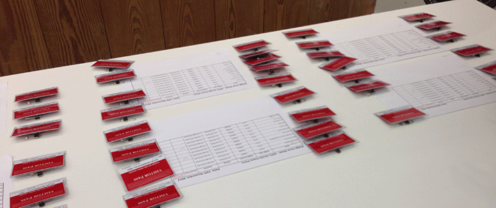
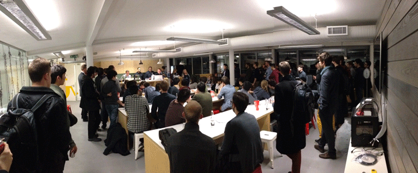

On a cold November evening, 60 Computing students travelled to Amazon's London offices at Amazon Development Centre London based in Barbican.

After navigating the circle line, we received a warm welcome from ADCL's Managing Director Paula Byrne. 

With Beer and/or wine in hand we heard from team managers in different areas of Amazon's business, including "Big Screen" (Amazon Instant Video's presence on TVs and consoles) "Web" (their website presence) and "Platform" (creating the back end services). We also heard about the work at Amazon's other locations - Amazon Development Centre Edinburgh, their Seattle headquarters and the newly opened offices in Holborn.

After some pizza all attendees had the chance to view demos of current work by each of the teams, as well as chat to SDEs and recruiters about the available opportunities both for internships and graduate positions.

Anyone interested in the opportunities available at Amazon, both in the UK and abroad should view the intern and graduate brochure [here](http://www.amazon.co.uk/tech-grads)