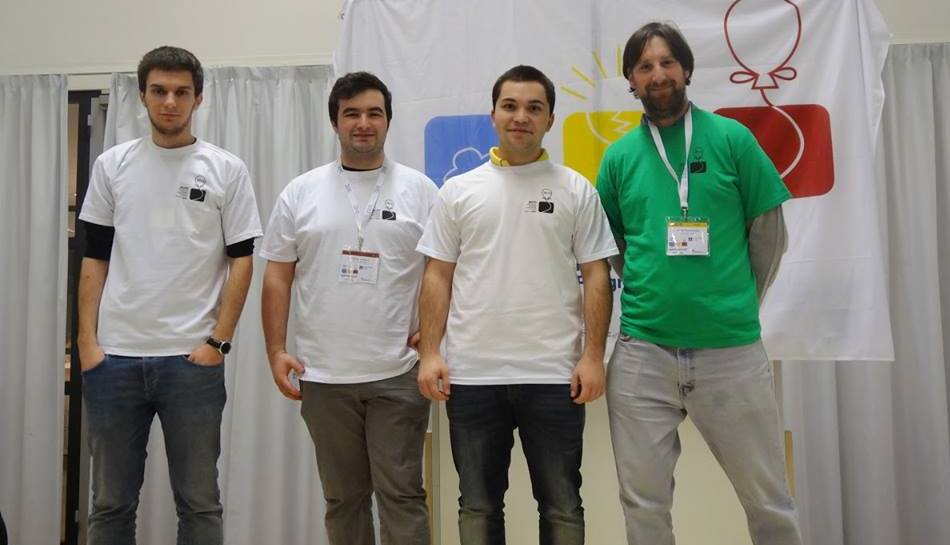

Between 22 - 24 november the Northwestern European Programming Contest took place in Delft, Netherlands.

Our university sent 3 teams to this contest:

- Intrepid Crazy Lynxes (Yordan Chaparov, Cosmin Carabet, Andrei Antonescu)

- OlteniaForceONE (Adrian Draghici, Ilie-Cosmin Paunel, Dan Danaila)

- RoCo (Paul Grigoras, Andrei-Ioan Cioara, Mihai Popa)

Out of 92 participating teams our teams placed **12th**, **31st** and **73rd** with the Intrepid Crazy Lynxes securing a Bronze medal for their 12th place finish.

