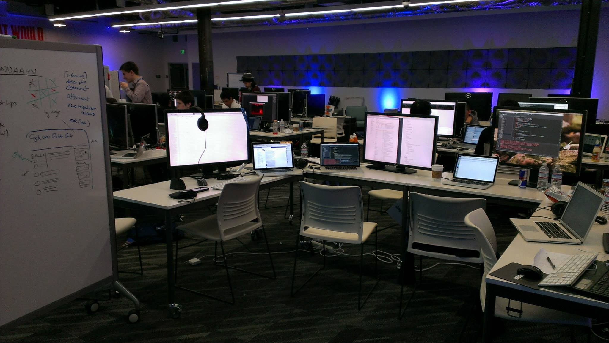
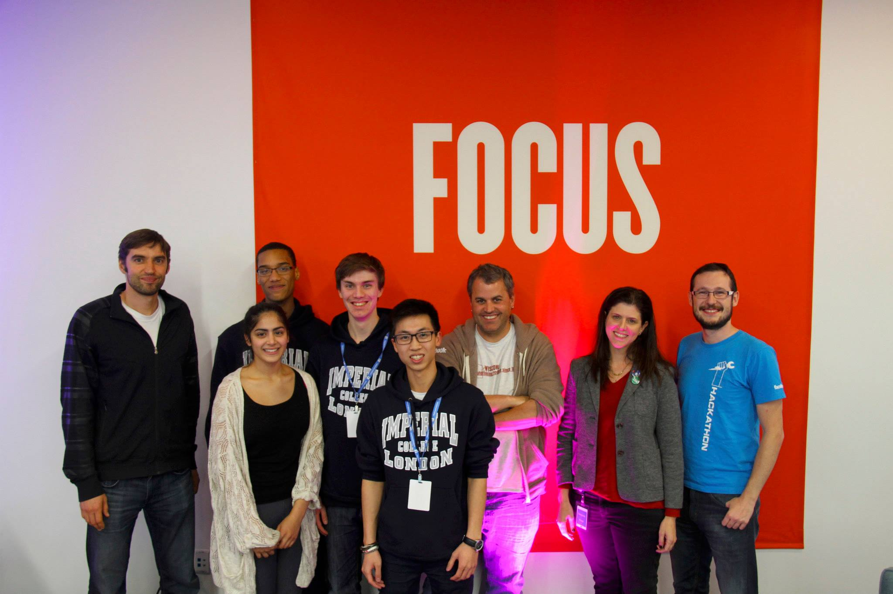

Meet the team.

That's **James** on the left. He's a front end dev with me. In the middle is **Ains**, our polyglot, super-efficient, hacker, and to the right, **Preeya**, back end dev and chief of all things operational.

And that's me, **Ben**, in the little circle up there. I'm the UX/UI and general front end dev guy.

---

At an hour of the morning rarely seen by Computing students, and unable to stop yawning, we sat in Heathrow airport waiting for BA 285. It would take us to San Francisco, and the global final of Facebook’s College Hackathons. We (sleepily!) talked over our hack idea - an application to make travel planning with friends painless - as we boarded the plane. We had qualified for the finals by taking first place at the college hackathon held at Facebook’s London office earlier in the year, and we hoped to do the same at Menlo Park.

---

## Touchdown SFO

After settling into our hotel, we went bowling in SF with Facebook. We met their awesome engineers, the other finalists, and found out who sucked the most at throwing a ball in a straight line (me…).

Once back at the hotel though, we slept like logs.

---

## Hack Day

The morning of the hack had arrived, and after the bus dropped us at 1 Hacker Way, Menlo Park, we were led to the hack space.

*Holy cheeseballs, it was awesome.*

They hadn’t spared any expense. Each hacker was given a Hackathon rucksack, a gigantic monitor, a keyboard and mouse, and a pair of the sweetest Sennheisers I have ever known. The swag didn’t stop there though. During the hack we managed to end up with a Facebook Snuggie as well as a Macbook Pro (because James’ eMachine had a mild inferiority complex).

Once we’d set up, we were assigned a mentor, a Facebook engineer named Alok, who worked on the Hip-Hop Virtual Machine. He took us on a tour of the campus, and if we’d been blown away by the hack setups, that was nothing compared to seeing the campus.

It was like Disneyland...

...but for hackers.

Nearly all of the onsite restaurants served free food, there was an arcade, sweet shops and ice cream shops, and bicycles could be seen scattered all over campus in case you got bored of walking between buildings. It goes without saying that we cycled more than we walked!

It felt more like a theme park than a multibillion dollar company, and it wasn’t hard to see why it attracted the best engineers.

")

After lunch with our mentor, we heard Sheryl Sandberg, **Facebook COO**, talk to us about building things that solve problems and the importance of hack culture at the company. Once the applause died down, the hackathon kicked off.

---

## Get Hacking!

With the ideation already started, we began with sketching out wireframes and listing out all the different views and interfaces we would need, as well as all the APIs we could use and how they would plug into the front-end. We’d somehow managed to wrangle two TripAdvisor api keys by pouncing on a Technical Manager at the Imperial Careers fair, which was a perfect fit for what we wanted to do.

Next, we confirmed our app stack - Django, Underscore, Handlebars for templating, and of course trusty Bootstrap 3 for building the interface (we would later add Pusher for realtime notifications). With a plan laid out, we set to work.

Meanwhile, around the room, a frightening array of gadgets could be seen (two Oculus Rifts, several pairs of Google Glass and a LeapMotion controller), and everyone was deep in conversation, or beginning to code.

Time seemed to disappear quicker than it ever did, and time was our team’s most prized commodity, because we’d set ourselves a lot to do! Before we knew it, dinner had arrived, and as the saying goes - *what’s a hackathon without pizza?*

We did however, get time during the night to talk to the other teams, visit the arcade, and even get signed books from the Andrei Alexandrescu, creator of the D programming language (who, as it turned out, worked on the seat next to our mentor).

The night was not without its challenges. We had to hack a jQuery calendar plugin beyond recognition both functionally and visually (thank God, because it was horrendously ugly), wrap APIs, and merge our work at unholy hours of the morning.

By breakfast however, we had an app. We named it **Indago**. We had the APIs working and most of the interface was complete, with just realtime notifications to implement. After a quick run to the canteen for breakfast, we spent the rest of the morning in the same cycle.

*Tweak. Polish. Bugfix. Repeat.*

With twenty minutes to go, I threw together a home page, and suddenly, the hack was over.

---

## Demo Time

As we migrated to a presentation room, eyes bleary and checking we hadn’t broken anything, we were given the rules. Two minute demo and no more, PowerPoints were banned, and if your hack doesn’t work - *heaven help you*.

The judges entered - two from Mobile and Advertising, and a senior engineer - and the demos began.

We watched in fascination as the other finalists presented their ideas - an educational Python game, a Glass facial recognition app, a VR hack with an Oculus Rift and suddenly **we were up**.

Ains and Preeya led the demo, as James and I sat with the judges so they could see both sides of the story with our app. Preeya explained how the idea for our hack came about - struggling to plan our next couple of days together in California - and then, using our app and with the help of both the judges and audience, we planned, live, our weekend in the Bay Area.

It seemed a hit. People *ooh*ed when James shared an event suggestion to Ains on the big screen, and people *aah*ed when we hit the merge button to create the event schedule. With only a few seconds left, as we showed off our last feature, exporting the schedule to iCal, we hit a **server 500** error, and the groans of disappointment from the crowd echoed ours. What a shame! Still, we felt pretty proud.

We watched the rest of the presentations (featuring a Leap Motion controller to turn any screen into a touch screen) and headed back to pack up.

---

## The Results!

In the hack space, the results were announced.

Special mentions went to an app that connected strangers with social similarity, third place went to Mexico for their brilliant iOS game. As we applauded them receiving their prize (*Facebook hammocks!*), the rest of the results were announced.

Suddenly we realised - **we’d taken second place**!

Feeling incredibly proud, we went up to collect our prize (Sphero’s!) as one of the judges praised our slick interface, our targeting of an unsolved problem, and the huge amount of features we’d managed to implement in 24 hours.

First prize went to Vancouver, who had built upon their qualifying hack to use iBeacons to provide additional information and social recommendations based on where you walked in a shop. The grand prize was $1,000 for each team member and a severe amount of kudos!

With the hack over, we headed back to the hotel, grabbed food with the other finalists, and caught some long needed sleep. It had been an amazing experience, and it had been great to hack amongst some of the best universities in the US and South America. Facebook’s company culture and pretty spectacular hosting had given everyone a taste of a company culture that was exciting, engineer-oriented, and just downright fun. We came away with some awesome friends, a new app, and even a title to bring back home.

*P.S. If you happen to be interested, we're going to continue working on the app - keep an ear out for news!*
