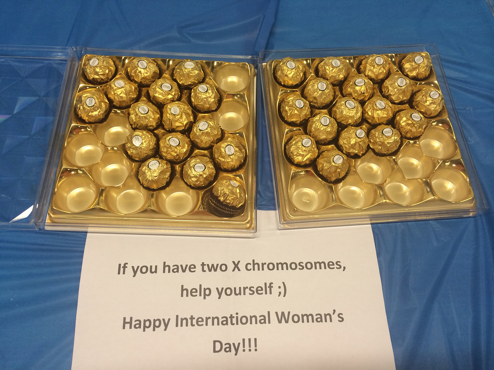

Another year has rolled by; a rollercoaster ride of lectures, courseworks, projects, deadlines and awesome DoCSoc events - and, yet, you know as well as we do that there’s only one thing that *really* matters.

You guessed it, of course - DoCSoc’s annual ICHack event, and, thanks to a huge number of sponsors and collaboration with the lovely people over at Imperial’s Business School, this year’s hackathon was quite possibly the biggest yet. 

We had Google Glass.
We had Leap Motion.
We had Tobii Rex.
We had Pebble.
We had Oculus Rift.
We had Microsoft Kinect.
We had MakerBots.
We had over 150 developers, designers and business students.
And we had Ferrero Rocher.

*Well, some of us did.*

If you’re reading this and wondering what exactly a hackathon *is*, then SHAME ON Y- nah. Actually, it’s pretty straightforward. A hackathon is what happens when you take a group of wonderful, wonderful geeks, put them in a room, give them lots of food and Red Bull and tell them they have 24 hours to create...something. It could be an app, a website, a hardware hack, an API - usually, the only real rule is that it has to involve technology in some way. The results nearly always range from cool, interesting, useful or funny all the way to absolutely awe-inspiring; that’s why some huge companies like Facebook are so keen on their hackathon culture.

We didn’t set a strict theme for the weekend, but offered lots of special prizes for those hacking on devices - and boy oh *boy* did we have devices. Thanks in a large part to Max, our partner from the Business School, we managed to get our hands on some really cutting-edge gadgets - including, of course, the elusive Google Glass.

*You’d think these would have been fought over. You’d be absolutely right.*

We kicked the whole event off on Friday evening, with a series of introductory talks from various experts on the individual devices. These included Toby Sims from Pearson on APIs, Larissa Kunstel-Tabet on 3D printing and our very own Tom Wilshere introducing Pebble. Attendees were given helpful advice on working with the many and varied APIs, libraries and devices that were on offer; this meant once they arrived at the hackathon, they could get right down to business without having to first spend hours trawling through documentation.

The first day of the hackathon proper dawned bright, clear and rather warm; perfect weather for sitting indoors hunched over a screen. Our illustrious Chair and I met at Tesco’s in Earl’s Court at 8am, to pick up such essentials as Coke, Red Bull, cereals and many, *many* crisps. We managed to fill not one, not two, but three shopping trolleys - rather a shock for the very tolerant lady at the till, but the driver of the taxi we managed to fill to the brim didn’t bat an eyelid. Cabbies have seen everything, I guess.

<table><tr><td width="50%">

</td><td>

</td></tr></table>
*Let it never be said we don't look after you.*

Eventually, we managed to get everything unloaded, devices unpacked, our venue (the Business School cafe) prepped - ready to go.

People started showing up around 11, and we had a huge flood of participants; developers, designers, business students...you name it, everybody wanted in. We actually ended up having to turn away a few people who hadn’t registered, which was quite sad.

After pretty much everyone had drizzled in, had some snacks and grabbed as much swag and they could carry, Michal opened the hackathon with a short talk. There was a massive flood to get the devices needed for projects, and then everyone settled down and the work began.

<table><tr>
<td width="50%">

</td><td>

</td></tr></table>

As one of the organising team, I wasn’t really working on anything - this meant I had plenty of time to wander around and have a nosy at what the different teams were building. At this early stage there wasn’t much in the way of polished software to see, but it was interesting to see the teams hard at work. One group had a chap waving his arms around in front of a Kinect with an Oculus Rift (which is *amazing*) on his face, and another were slowly plastering the walls with diagrams, flowcharts and sketches. All very productive.

*Things were pretty busy on the organisation front too.*

The work continued until around 5pm, when we had a short break for food - lasagne. Rather tasty. We had *another* food break at 11pm, when some pizzas arrived, generously paid for by Microsoft, one of our sponsors. Hackers need fuel. Speaking of which, it was around this time we cracked out the Red Bull and settled in for the night shift.

*There was quite a bit less food left than this by the time I got there.*

At last year’s IC Hack, this bit of the hackathon wasn’t quite so successful - we didn’t have the venue overnight, so a few of us headed to the library and the rest went home to get some shuteye. Happily, this wasn’t the case thanks to the Business School letting us in for 24 hours - the majority of hackers were hardcore, staying up all night working. Much caffeine was consumed. A few people - including some organisers - didn’t make it through the night.

<table><tr><td width="33%">

</td><td width="33%">

</td><td width="33%">

</td></tr></table>
*Sleeping beauties Lawrence, Michal and Max.*

We put out some cereal around 3am, much to everyone’s delight (especially mine), and at around 8am we had some breakfast. Work continued until midday, when time was up, and we had some lunch before migrating to the Clore lecture theatre for the presentations, judging and awards. Groups had ten minutes each to present and demo their idea and hack, and there were several prizes available for the various devices, as well as DoCSoc’s overall prize of £500.

*Those chaps in the front row were our judges.*

If you’re not actively participating in the hacking bit, the most exciting part of a hackathon is usually the demo session - and ICHack was absolutely no exception to the rule. There were so many amazing projects, and I don’t really have space to write about every single one of them, but here are a few that really stood out to me, personally:

- A window manager for Linux, using the Oculus Rift and Kinect to display and manipulate windows in 3D space, by turning your head and moving your hands. This went on to win the overall DoCSoc prize.
- A live Rubik’s cube solving assistant for Google Glass. The Glass used its camera to recognise the current configuration of the cube, and displayed the steps to complete it using a 3D model on-screen.
- A Google Glass app, and accompanying 3D-printed ‘key’, to assist reading for children with dyslexia, by helping them to isolate words on a page.
- An alarm clock for Pebble that used location rather than time - it could wake you up on a train or bus as you approached your destination.
- ‘Legless Jedis’ - an app using Leap Motion and the Tobii Rex eye tracker. Players could move around a virtual environment by making ‘walking’ motions with their hands, and turn by looking at the corners of the screen.

*Another cool (and slightly creepy) app was this reading assistant for children, using the Tobii Rex to highlight words.*

After the judges made their decision, the winners were chosen and prizes given out. We’re going to post a full winners’ list soon - stay tuned for that!

This year’s ICHack was bigger and better than ever before; I’m dead excited to see what we can pull off next year.
Especially given you’ve voted me in for secretary again. ;)

*All our winners. Huge thanks to everyone who participated!*

