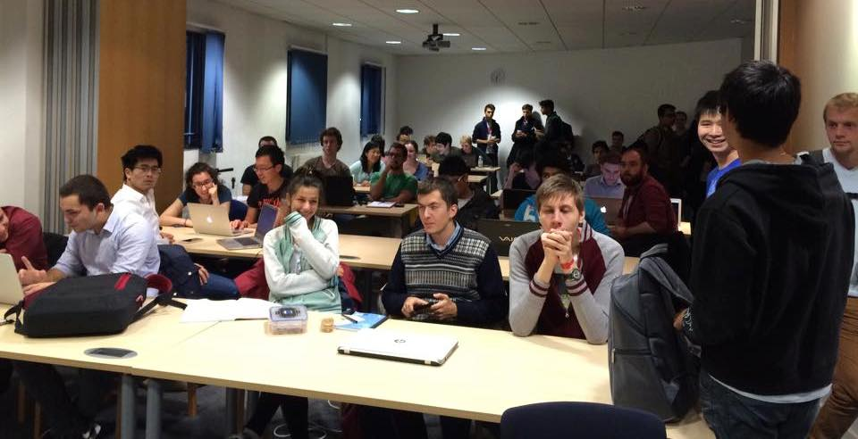

Hello DoC'ers and welcome to 2015! Before we get on to all the exciting events we're planning for this term, it's worth taking a look back at one of our busiest terms to date!

Hoodies
=======
Our hoodie shipment arrived and we've united 80 wonderful students each with a beautiful DoCSoc hooie! We've subsidised the hoodies 25% off cost price each to ensure everyone who wants one, gets one.

*Even bears need to keep warm in winter! (NB: Not a zoologist)*

Freshers Fair
=============
At the start of the year, DoCSoc - along with over 300 other Imperial societies - took part in the Freshers Fair. We grabbed our banner, loads of chocolate and introduced ourselves to all the new Computing and JMC students! We ran a speed-typing challenge at the stall - and to make things interesting we provided a blank keyboard! That didn't faze our winner, who scored a massive 154 words-per-minute!

*Yulia and Nic at the stall*

First Year Buddies Lunch
========================
Our most successful buddy scheme yet! The buddies lunch connects first year students with cheerful mentors in other year groups. Through cooperation with the department we were able to grant all 250 attendees a free lunch and a DoCSoc swag bag (Full of goodies donated by our [sponsors](/sponsors).

Networking with Credit Suisse
=============================
Our first industry event of the term! Our returning sponsor [Credit Suisse](https://www.credit-suisse.com/global/en.html) provided free lunch and stellar career help for 50 lucky attendees.

Internship 101
==============
Our student-lead knowledge share. A panel of returning students fielded questions from an audience of 60 and shared their experiences working at a broad variety of companies: large, small, local and abroad! This is one of our favourite events of the year. It provides candid insight into a range of companies, and sparks discussion across all Computing undergraduates.

*Our panel fielding questions from our audience.*

Microsoft Coding Challenge
==========================
Our second industry event, with a tech focus! [Microsoft](http://www.microsoft.com/) challenged our students to compete in teams to solve programming-riddles and win the grand prize of an XBox One!

*Everyone gearing up for kick-off!*

GoCardless Bar Night
=====================
[GoCardless](https://gocardless.com/) sponsored our first bar night of the term, and also our most popular in recent memory! Falling just after graduation day, 110 students and alumni chatted with the GoCardless crew, which included two previous DoCSoc presidents!

*Happy drinkers at the GoCardless Bar Night.*

Amazon Office Trip
==================
75 of us piled on to the Tube straight after lectures to make the short trek to Barbican to visit Amazon on their gorgeous home turf! [Amazon](http://amazon.com) were wonderful hosts, providing drinks and pizza; and even flew some of their engineers down from Edinburgh to meet us!

*We absolutely packed Amazon's office.*

Board Game Night
================
Our very first board game night! From Monopoly to D&D, a mass of students enjoyed games, warm company and plenty of free snacks and drinks!

*We had a huge number of board games!*

Interstellar IMAX Trip
========================
My favourite movie of 2014! At Imperial College we have the wonderful privelage of counting The Science Museum amongst our neighbours. When we heard the were showing Interstellar in true IMAX. DoCSoc subsidised the tickets to half price. After we ran out of our initial batch within two hours, we purchased a much larger batch which ran out in just two hours! 

*We sure know how to queue.*

Ice Skating
===========
Our most enchanting trip! DoCSoc graced the Natural History Museum's annual ice rink and warmed up enjoying complimentary Hot Chocolate - all half price of course!

*Chilly weather - perfect!*

End of Term Bar Night
=====================
To celebrate the end of exams and coursework - DoCSoc sponsored free nachos and drinks at Eastside Bar! We quickly found ourselves running out of nachos so did the only respectable thing and doubled our order!

One more thing...
==================
We've ordered some new gadgets for the DoCSoc store cupboard! They've arrived so [get in touch](mailto:docsoc@imperial.ac.uk) if you want to play with our new Oculus Rift DK2 and Leap Motion!

What's next?
============

Thanks for asking! Just within the next few weeks we have:

* Industry talk from our generous sponsor [Schlumberger](http://www.slb.com)
* A hands-on security workshop "[Victims & Villains: Stealing Passwords for Fun & Profit](http://docsoc.co.uk/vnv/)" from [Netcraft](http://netcraft.com)
* And, of course, [**IC HACK**](http://ichack.org)!
