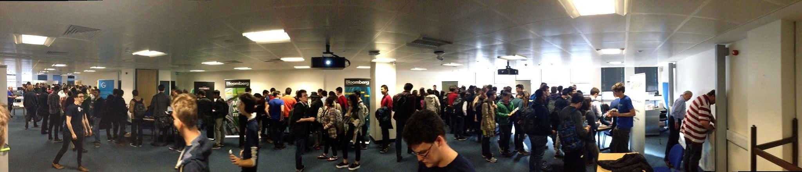
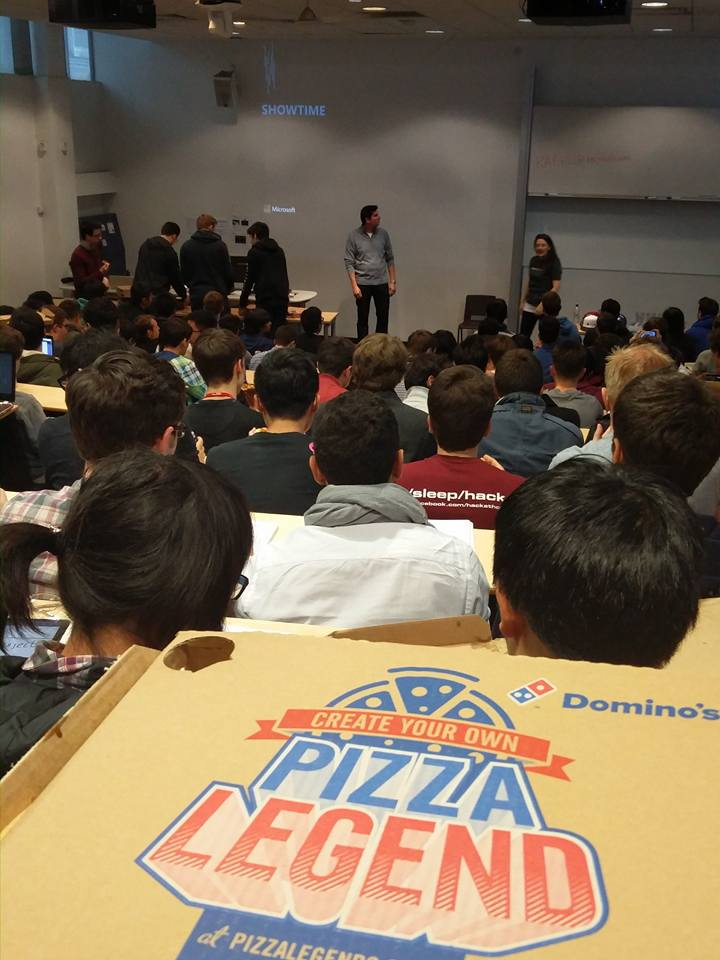
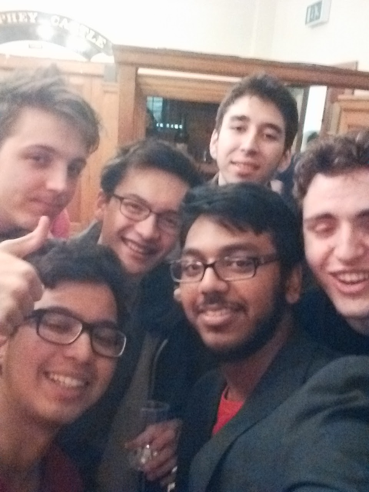
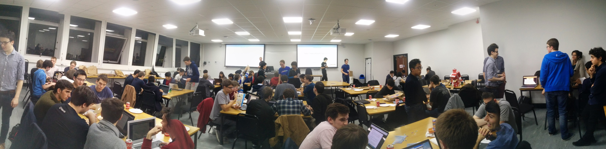
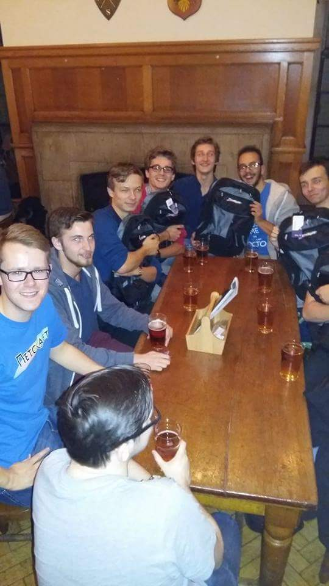
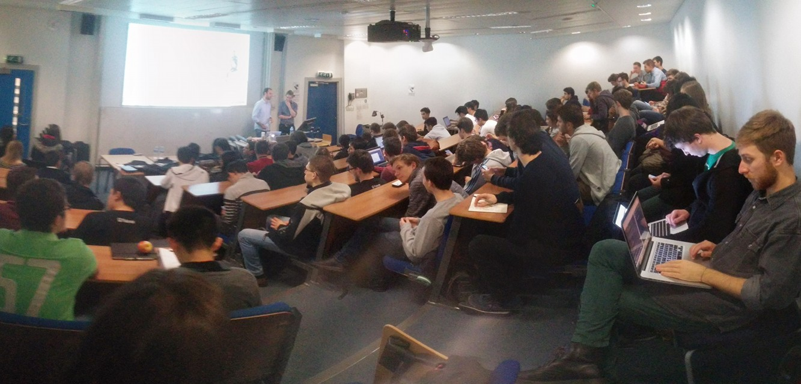
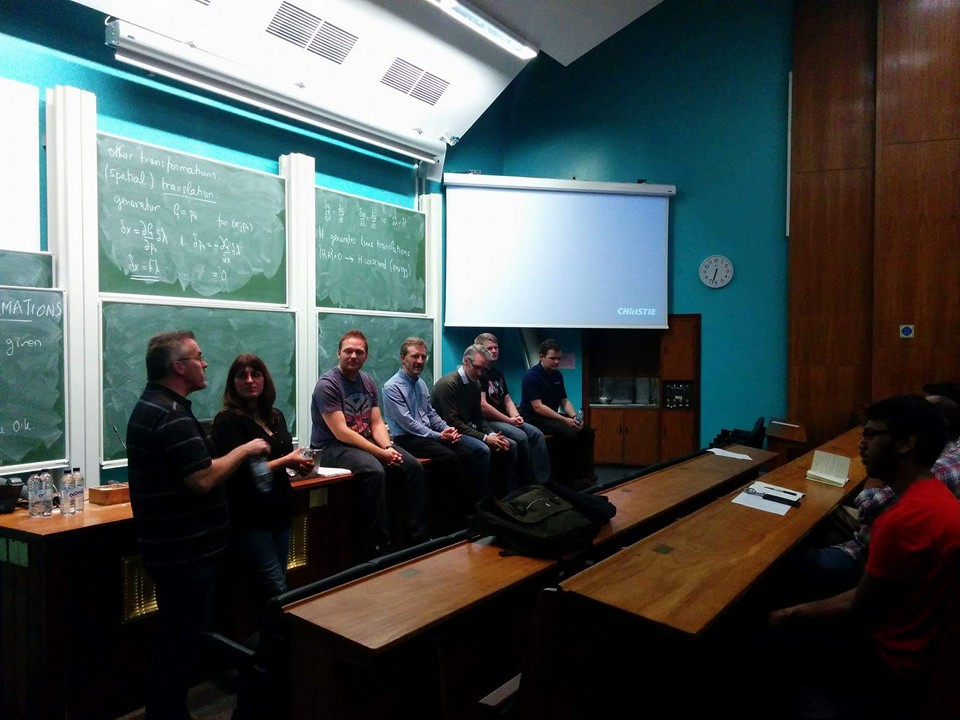
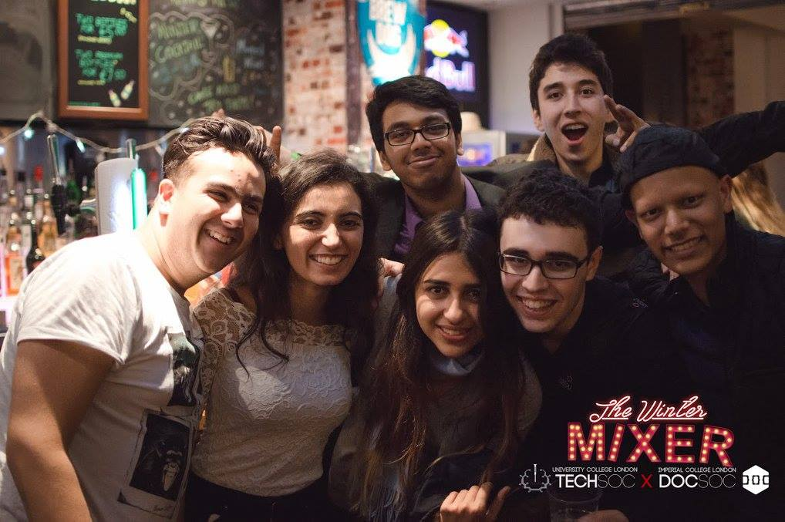
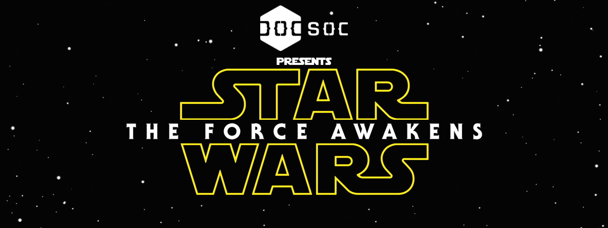

It's been exactly 11 months since we last posted to the blog, so Christmas seems a good a time as any to revive this thing!

Nic said last year's first term was full of events, well this one was even more so. Here's a look at what happened this term at DoCSoc...

Careers Fair
=======
We were again present at the college-wide freshers fair, but that's the same story every year really. This year, we ran our own little fair (sadly no blackjack or hookers), and invited numerous companies to set up their own stall and sell themselves to Computing and JMC students. It was a massive success, with many people sending off internship and job applications, and we hope to run one again next year!

*Packed!*

First Year Buddies Lunch
========================
Another year, another successful buddies lunch! This lunch connects first year students with cheerful mentors in other year groups. Through cooperation with the department we were able to grant every attendee a free lunch and a DoCSoc swag bag - each filled with tons of goodies from our generous sponsors!

<!-- 

*Sponsor swag and DoCSoc swag bags!*
 -->

Microsoft Tech Talk
==================================
Tom Baxter, who's been working at Microsoft for the last 15 years, came to Huxley to talk to us about the major topics regarding Microsoft. Reshaping Windows, dealing with Big Data, and teasing Cortana - Tom gave an engaging talk, followed by a question and answer session. Much pizza was had. Tom has worked in almost every division of Microsoft, but he was mainly a Windows person, so I thought it'd be a great idea to ask how he didn't see that Windows Vista was going to be a flop as they were developing it. Yeah, brutal.

Microsoft Workshop (How To Ace Your Technical Interview)
==============================================================
Not haunted by my question, Tom came back the next day to guide students on how they can ace their interviews at Microsoft. Tom has a large amount of experience as an interviewer, so this was the perfect chance to pick up hints and tips that can make someone's application successful. Again, there was a ton of pizza for attendees.

*Pizza Time!*

DoCSoc Bar Night
====================
Of course, there had to be a bar night! Barely a month into the start of term, it seemed a perfect time to indoctrinate freshers into ye olde DoCSoc tradition. Every attendee was given 2 drinks tokens, absolutely free! It was a raging success, and I suspect our President had a strong headache the next day.

*Squad.*

Netcraft: Dark Markets
=============================
Our trusty sponsor Netcraft once again returned for an evening of nefarious internet-related activities. This time, they came to talk to us more about Tor, and set up the attendees into teams, each of which has to hack into each others' shop on the dark web. Did I mention the pizza? The winners of the night were Team Unicorn, so give them a hearty applause.

*Everyone busy with their task.*

Netcraft: Bar Night
=======================
There was never just one, of course we had another bar night! This one was straight after the Netcraft: Dark Markets event, and it was a chance for the winners to have a nice chat with the some of the people working at Netcraft.

*Go Team Unicorn!*

Skyscanner Tech Talk
============================
Andrew Philips, Senior Technical Managar at Skyscanner, came down from Scotland with some of his crew to talk to us about the Complexity of Travel. It was really interesting to get an insight into how folks at Skyscanner mix Big Data and Artificial Intelligence in order to apply it to their business. After the event, we invited everyone down to have a healthy (ironic) dose of pizza!

*Absolutely packed lecture hall!*

Board Games Night
================
Our first board games night of the year, it was brilliant to have so many people turn up. We now have a partnernship with Board Games Society, which should mean even better collections of games from now on.

NewVoiceMedia: Meet the Founder
=================================
The founder and senior engineers of NewVoiceMedia came as a pack to Imperial, so that students could ask them questions left, right and centre about anything! Well, not anything, but you catch my drift. After the event we made sure everyone was stuffed with pizza, before handing out tokens for yet another Bar Night! Sponsored by NewVoiceMedia, they held the tokens, and gave tokens based on how good a question was. It was a brilliant night, and hopefully we'll have many more like this.

*Great to have a Fireside chat.*

Amazon Office Trip
==================
Around 60 of us got on the tube and headed to central London to visit Amazon at their office! It was great to meet engineers there and get a look around the office.

The Winter Mixer: TechSoc x DoCSoc
======================================
Remember, remember, the first of December, when we joined UCL's TechSoc at their Union for a casual mixer! It was great to meet people of various years at UCL, and even better to hear how bad they thought their course was (just kidding!). There was a kerfuffle on the Facebook event when KCL TechSoc asked why they weren't invited, but rest assured that event is likely to come up next term.

*Amin and I blending in.*

Star Wars IMAX Trip
========================
The biggest movie of 2015! Nic mentioned in the last post about how fortunate we are that the Science Museum is one of our neighbours, and when we saw that Star Wars: The Force Awakens would be shown there in 70mm IMAX, we knew what we had to do. We had multiple batches of ticket sales, each of which sold in under 15 minutes - absolutely blitzing the record held by Interstellar's ticket sales last year. Unfortunately when we got to the cinema, we were told that 65 tickets were for the wrong day - an error that both we and the Science Museum should have spotted. It was incredbly sad to turn away people at the door, but we have arranged to give everyone a full refund.

*I couldn't any other picture for this, and I really liked this picture.*

End of Term Bar Night
=====================
An old saying goes like this: to heal our outside, we pour alcohol on flesh, but to heal our insides, we drink it all up! Nothing could be more true as we sent off this term in style with one of our best Bar Nights yet! We've kept up our ethos of giving free bar tokens, and it made everyone very happy - as you can see below.

*Bar Night and Chill?*

What's next?
============

Thanks for asking! We can't confirm dates, buuuut...

* Microsoft talk!
* Video Game Night!
* Bar Nights!
* And, of course, [**IC HACK**](http://ichack.org)!

Hope everyone has an abundantly Merry Christmas, and a fantastic New Year!

That's all folks!

Paul
