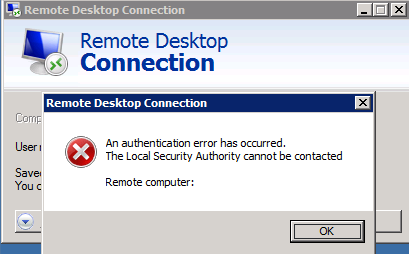

### The Problem

I have run into this error a few times in the past. Each time I do, I solve it and forget about it, so that it stymies me for a few minutes the next time I run into it. Hopefully after writing this post I'll remember next time.

### The Error

    Remote Desktop Connection:
    
    An authentication error has occurred.
    The Local Security Authority cannot be contacted
    
    Remote Computer: hostname or ip

### The Reason

There are myriad reasons why this could crop up. However, for me it has always been one:
#### User must change password on next logon

Under many situations (such as when the local computer isn't a member of the remote computer's domain) the Remote Desktop Connection application can't handle the prompt to change a user's password when Network Level Authentication is enabled. 

### One step forward, two steps back

With previous versions of the RDP protocol, a user was allowed to change their password graphically after signing on. However, NLA has no such provision, at least the way it's implemented in RDC. So, if you have to change your password you are SOL unless you can get to a console.

### Workaround

In my case, I was able to sign on to a domain member's console using the VMware vSphere Virtual Machine Console. When I did that, I got a friendly password change screen:

After setting a new password, subsequent Remote Desktop logons work fine.
